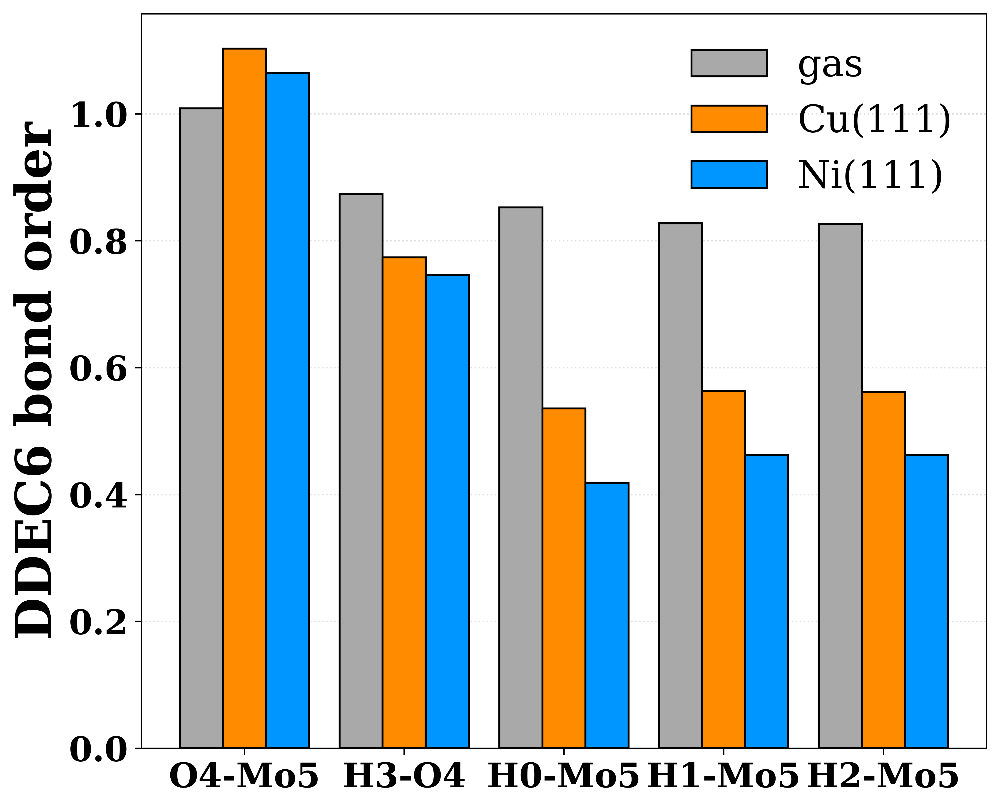

# Cross-System Eigenmode Mapping (CSEM)

Compare how the **same molecule** behaves on **two different substrates** by
establishing an explicit, atom-by-atom correspondence between the two systems
and then reading off what changed.

The same adsorbate looks different on each surface: its atoms come out in a
different order and a different orientation, its vibrational modes are reordered
and mixed, and new molecule–metal bonds appear. Before anything can be compared,
the two systems must be put into correspondence. CSEM does this once and applies
it to two observables.

## The problem

Given the same molecule (a) in the gas phase, (b) adsorbed on substrate A, and
(c) adsorbed on substrate B, two natural questions have no answer until the
atoms are matched:

- **Which vibrational mode on A is "the same motion" as which mode on B?**
  Frequencies alone do not pair modes — modes reorder and mix between systems.
- **Which bond on A (or B) is the same bond as in the gas-phase molecule, and
  how did its strength change?** Atom indices differ between calculations, and
  new molecule–metal bonds appear on the surface.

## The approach

First align the molecule across systems (rigid rotation + an atom permutation
that only swaps like elements), then compare a single observable:

- **Eigenmodes** (case 1): a mode is a unit displacement vector over the
  adsorbate atoms. Their similarity is the absolute cosine overlap
  `S_ij = |v_i(A) · v_j(B)|`, and a one-to-one pairing is read from `S`.
- **Bonds** (case 2): each gas-phase bond is located in the adsorbed system
  through the atom map, and its DDEC6 bond-order change `ΔBO = BO_ads − BO_gas`
  is recorded, together with an activation label.

Both cases are self-contained, runnable subprojects with their own data, staged
scripts, and README.

## The two cases

| | [`case1-vibrational-mode-mapping`](case1-vibrational-mode-mapping) | [`case2-bond-mapping`](case2-bond-mapping) |
|---|---|---|
| Question | which mode ↔ which mode | which bond ↔ which bond, and how strong |
| Observable | eigenvector overlap | DDEC6 bond order |
| Reference | Cu(111) ↔ Ni(111) | gas phase ↔ Cu(111), Ni(111) |
| Output | overlap heatmap + matched pairs | bond-order comparison + activation labels |

<p align="center">
  
  &nbsp;&nbsp;
  
</p>

## Case study

Both cases use **H3MoOH**, a molybdenum hydride/hydroxyl species, adsorbed on
**Cu(111)** and **Ni(111)**. Geometries, frequencies, and electron densities are
from periodic plane-wave DFT (**VASP**); bond orders are from a DDEC6
(Chargemol) analysis of those densities. The systems are those of:

> Kambale, E. M.; Rivera Rocabado, D. S.; Kanematsu, Y.; Ishimoto, T.
> *Field-Dependent Redox Thermodynamics of MoOₘHₙ Species on Cu(111) and Ni(111)
> Surfaces under Alkaline Hydrogen Evolution Conditions.* Preprints.org, 2026.
> DOI: [10.20944/preprints202604.0944.v1](https://doi.org/10.20944/preprints202604.0944.v1)

## Reading the two cases together

The two maps point the same way for the hydroxyl O–H bond. Case 2 finds its DDEC6
bond order falls from 0.87 in the gas phase to 0.77 on Cu(111) and 0.75 on
Ni(111) — a larger decrease on Ni (ΔBO = −0.10 vs. −0.13). Case 1 pairs the O–H
stretch across the two surfaces (overlap 0.86) and places it at 3544 cm⁻¹ on
Cu(111) and 3511 cm⁻¹ on Ni(111), a shift of about −32 cm⁻¹. The weaker O–H bond
on Ni and its lower stretching frequency on Ni are consistent.

## Repository layout

```
Cross-System-Eigenmode-Mapping-CSEM/
├── README.md                          # this page
├── LICENSE
├── case1-vibrational-mode-mapping/    # eigenmode overlap, Cu(111) vs Ni(111)
└── case2-bond-mapping/                # DDEC6 bond-order change vs gas phase
```

## Citation

If you use this method or code, please cite the study above
([doi:10.20944/preprints202604.0944.v1](https://doi.org/10.20944/preprints202604.0944.v1)).

## License

MIT (see `LICENSE`).
