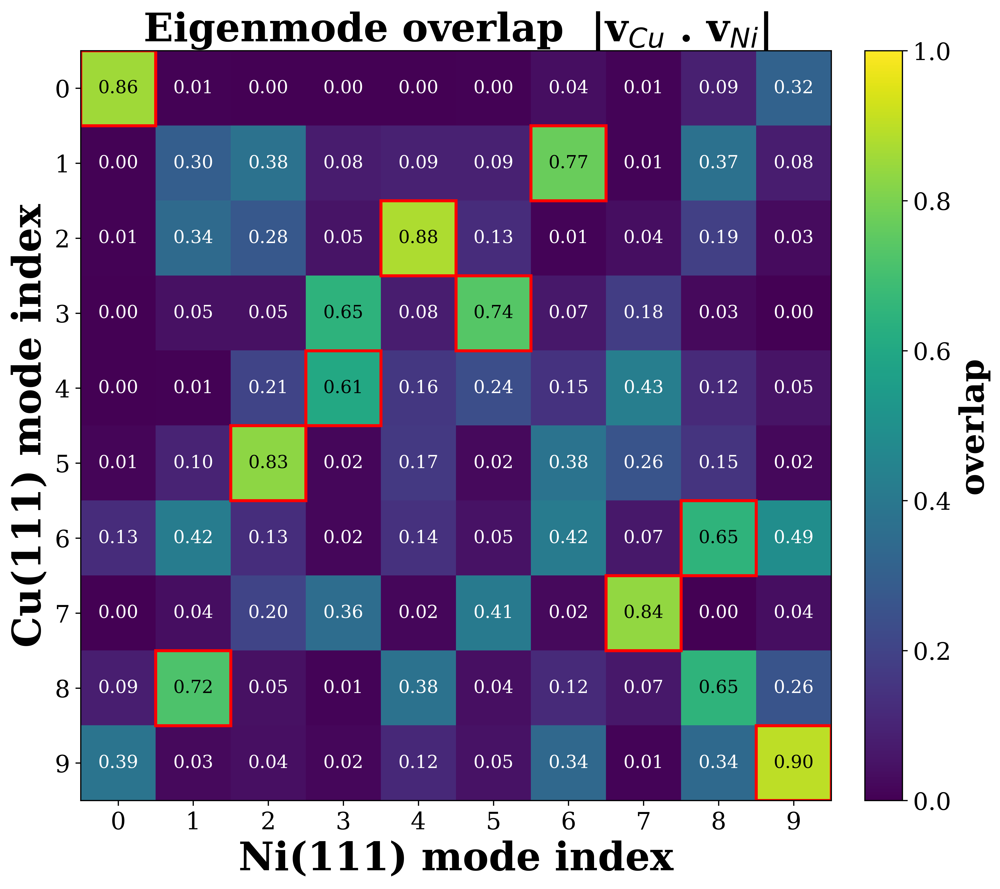

# Case 1 — Vibrational mode mapping (Cu(111) vs Ni(111))

Pair the vibrational modes of an adsorbed molecule between two substrates, by
overlap of their eigenvectors.

## The problem

Each adsorbed system has its own set of vibrational modes. To say "this Cu mode
is the same motion as that Ni mode" we need a correspondence, and frequency
order is not enough: modes reorder and mix from one surface to the other, so the
*n*-th Cu mode is generally not the *n*-th Ni mode.

## The approach

A mode is a unit displacement vector over the adsorbate atoms. Two modes are "the
same motion" to the extent their vectors are parallel, measured by the absolute
cosine overlap:

```
S_ij = | v_i(Cu) · v_j(Ni) |        in [0, 1]
```

For this dot product to be meaningful the two adsorbates must share one atom
order and one Cartesian frame, so the moved system (Ni) is first rigidly aligned
onto the reference (Cu):

1. a per-element **Hungarian** assignment fixes the atom permutation (only atoms
   of the same element may swap);
2. **Kabsch** superposition fixes the rotation `R`;
3. that permutation and rotation are applied to the Ni mode vectors.

The overlap matrix `S` is then formed and a **greedy one-to-one** pass pairs each
Cu mode with a distinct Ni mode in descending overlap. The pairing is read off
`S`; no mode is matched twice.

## Application: H3MoOH on Cu(111) and Ni(111)

The adsorbate is H3MoOH (6 atoms: Mo, O, 4 H). Frequencies and eigenvectors are
from periodic plane-wave DFT (**VASP**); `data/` ships the adsorbate-projected,
unit-normalized displacement vectors extracted from the VASP runs (the large
OUTCARs are not needed). Ten modes are compared on each surface.

<p align="center">
  
</p>

Rows are Cu(111) modes, columns Ni(111) modes, color is `|v_Cu · v_Ni|`; the
greedy one-to-one matches are outlined. `results/matches.csv` lists each matched
pair with its two frequencies and overlap.

## Data

| File | Meaning |
|------|---------|
| `data/POSCAR_Cu`, `data/POSCAR_Ni` | slab geometries (adsorbate atoms listed first), used only to align Ni onto Cu |
| `data/eigenvectors_Cu.csv`, `_Ni.csv` | one row per mode: `mode_index`, `freq_cm-1`, then `dx,dy,dz` per adsorbate atom |
| `data/freqs_Cu.csv`, `_Ni.csv` | mode index and frequency (cm⁻¹) |

## Usage

```bash
pip install -r requirements.txt
python scripts/step1_match_modes.py            # -> results/matches.csv, overlap_matrix.csv, mode_alignment.json
python scripts/step2_plot_overlap_heatmap.py   # -> results/overlap_heatmap.png
```

Set the reference/moved labels and the adsorbate elements in the configuration
block at the top of `step1`.

## License

MIT (see the repository root `LICENSE`).
